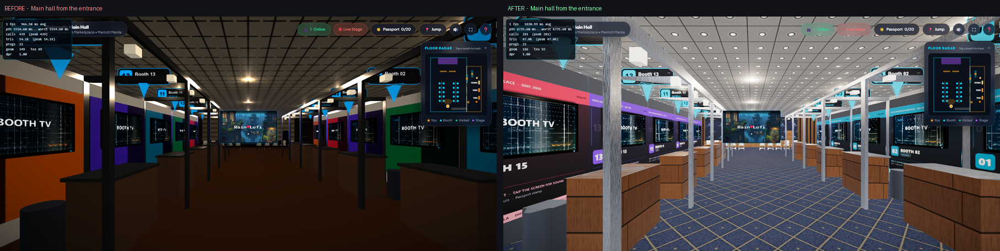
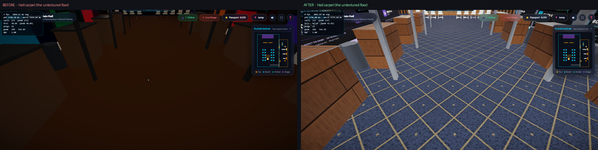
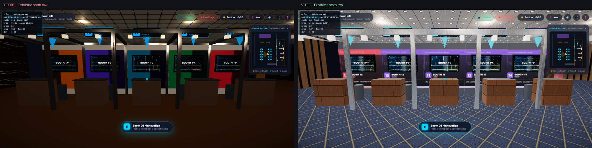
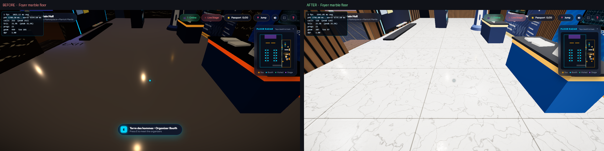

# Visual overhaul — before / after

Captured with `npm run capture` at four fixed poses (software WebGL, so absolute
shading differs slightly from a GPU; texture detail and material response do not).

| | Before | After |
|---|---|---|
| GLB size | 18.56 MB | **3.24 MB** |
| Triangles | 107,435 | **12,988** |
| Primitives (draw calls from the venue) | 384 | **47** |
| Materials | 151 | **42** |
| Primitives without UVs | 2 | **0** |
| Occlusion maps | 0 | **27** |
| `dist/textures` shipped | 21 MB | **536 KB** |
| Draw calls at the entrance | 439 | **281** |






## Regenerating

```bash
npm run textures   # procedural PBR maps + signage  (~12 min, deterministic)
npm run venue      # Blender export + GLB validation
npm run smoke      # 18 interaction checks against a running dev/preview server
npm run capture    # re-shoot these reference poses
```

`textures/` is git-ignored apart from the booth pop-up posters: the maps are
deterministic output of the generators and are baked into the committed GLB.
